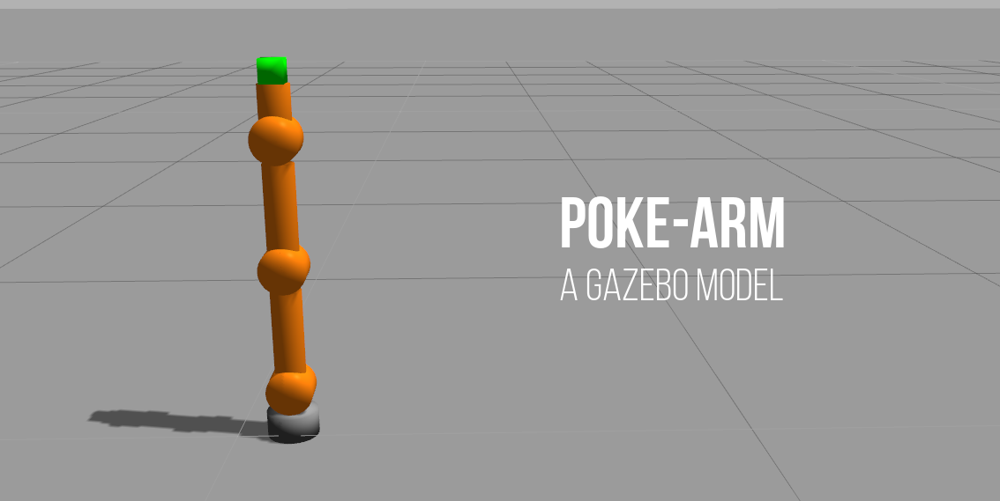

# poke-arm-gazebo

> NOTE: This package is still undergoing development.

An experimental gazebo robotic arm model with 4 movable joints. Designed to be mounted on the Turtlebot gazebo model.



## Installation
Git clone the repository to your workspace. There is no need to *catkin_make* the files.
```
$ git clone https://github.com/1487quantum/poke-arm-gazebo.git
```

## Overview
The poke arm is designed to push an object, therefore the *revolute* joints can only be moved in the x-axis direction.
Joints on the arm:
- 1 *fixed* joint
- 3 *revolute* joints
- 1 *continuous* joint

```
*****************************
*   Poke Arm Schematic v0.1 *
*****************************

       _
      |_|         <---- p3_link & p3_joint (Continuous)                 
     |   |        <---- p2_link                             
     !   !                                                  
     -----                                    
    (     )       <---- p2 joint (Revolute)                                                       
     -----
     |   |  
     |   |        <---- p1_link
     |   |  
     !   !  
     -----
    (     )       <---- p1_joint (Revolute)
     -----
     |   |  
     |   |        <---- p0_link
     |   |  
     !   !  
     -----
    (     )       <---- p0_joint (Revolute)
     -----
   =========
   #       #      <---- baseMount_link  (Fixed)
   =========

```
## File structure
The folder are organised into 3 parts:
- poke_description: Contains the URDF description of the robot.
- poke_gazebo: Contains *launch* files to start gazebo & spawn the model in it.
- poke_control: Contains the controllers used to control the poke arm.

## Testing
[Coming soon...]

## Mounting on Turtlebot
[Coming soon...]
